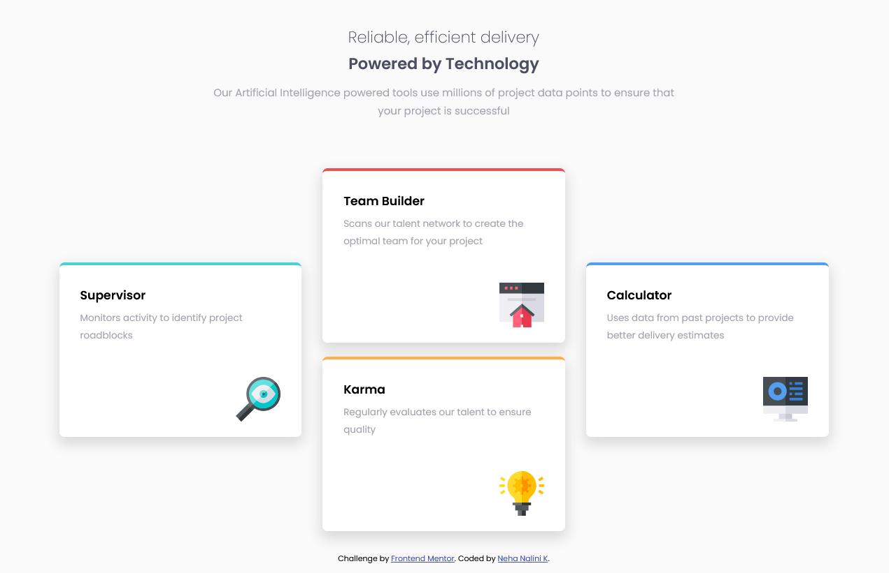
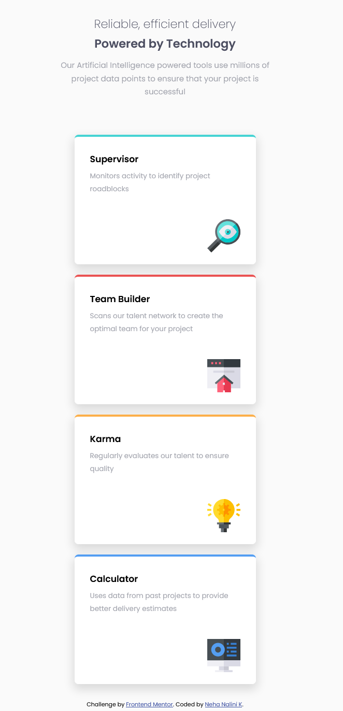

# Frontend Mentor - Four card feature section solution

This is a solution to the [Four card feature section challenge on Frontend Mentor](https://www.frontendmentor.io/challenges/four-card-feature-section-weK1eFYK). Frontend Mentor challenges help you improve your coding skills by building realistic projects.

## Table of contents

- [Overview](#overview)
  - [The challenge](#the-challenge)
  - [Screenshot](#screenshot)
  - [Links](#links)
- [My process](#my-process)
  - [Built with](#built-with)
  - [What I learned](#what-i-learned)
  - [Continued development](#continued-development)
- [Author](#author)

## Overview

### The challenge

Users should be able to:

- View the optimal layout for the site depending on their device's screen size

### Screenshot

### Links

- Solution URL: [Solution URL here](https://github.com/nehanalinik/four-card-feature-section-master)
- Live Site URL: [Live site URL here](https://nehanalinik.github.io/four-card-feature-section-master/)

## My process

### Built with

- Semantic HTML5 markup
- CSS custom properties
- Flexbox

### What I learned

Learnt about FLEX box !important. ☺

### Continued development

Love to do more projects on flex-box and grids to improve my knowledge on them.

## Author

- Frontend Mentor - [@nehanalinik](https://www.frontendmentor.io/profile/nehanalinik)
- Twitter - [@KennedyNalini](https://twitter.com/KennedyNalini)
